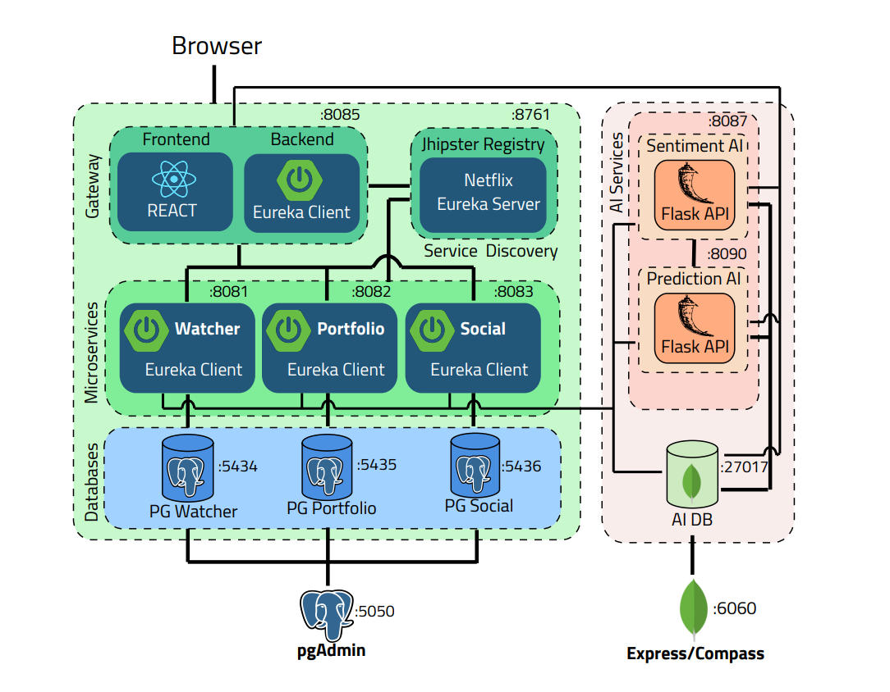
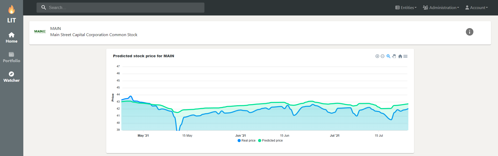

# LIT - Lean Into Trading 
LIT is a management and research platform designed to function like a social networking platform. For additional details and information, please refer to the accompanying [paper](documentation/degree_paper/master_degree_paper.pdf). 

# LIT Arhitecture 

# LIT app ss
## Home page post

## Home page search 

## Portfolio page

## Watcher page

